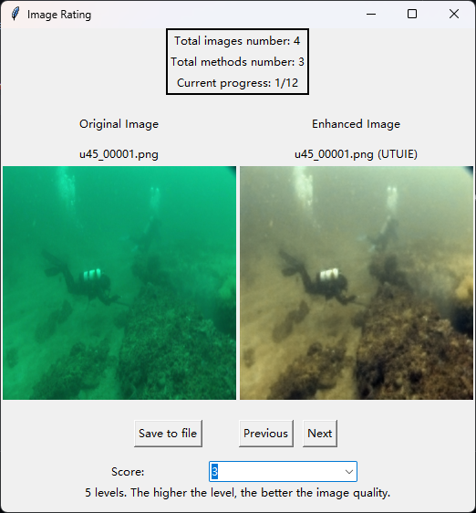

<p align="center">
  <a href="#">
    
  </a>
  <h1 align="center" style="font-weight: 600">ImgRating-GUI</h1>
</p>

An Images Rating Tools for assessing images enhanced results subjectively.

## Requirements

- python3
- tkinter
- pandas

## Usage
Launch the tool:
```powershell
python ./main.py
```

GUI demo:

